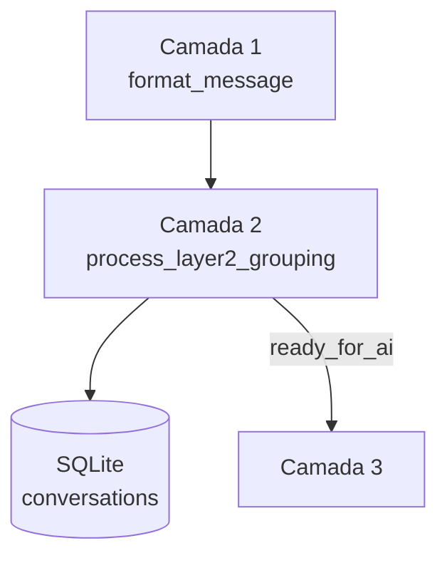

# 🧩 SWAI Pipeline - Camada 2: Agrupamento de Mensagens

## 📚 Visão Geral
A Camada 2 do pipeline SWAI recebe as mensagens já **formatadas** pela Camada 1 e as agrupa em conversas persistidas no banco SQLite. Cada chamada gera um identificador único de conversa e indica quando a conversa está pronta para a próxima etapa do fluxo.

## 🔗 Relação com Camadas 1 e 3
- **Entrada**: recebe um dicionário produzido pela `layer1_formatter` contendo `message_id`, telefones e `timestamp`.
- **Saída**: devolve `conversation_id` e a flag `ready_for_ai`, utilizada pela Camada 3 para acionar análises ou sumarizações.

## 🧠 Lógica de Agrupamento
1. Valida campos obrigatórios (`message_id`, `sender_phone`, `receiver_phone`, `timestamp`).
2. Determina quem é o **lead** e quem é a **secretária**:
   - Se `sender_type == "lead"`, o telefone do lead é o remetente.
   - Caso contrário, o lead é o destinatário.
3. Converte o timestamp para data (`YYYYMMDD`) usando `datetime.fromisoformat`.
4. Monta `conversation_id` no formato `<lead_phone>_<YYYYMMDD>`.
5. Registra a mensagem através do `SWAILiteManager.record_conversation_message`, que:
   - garante a criação da conversa na tabela `conversations`,
   - atualiza `message_count`,
   - preserva `start_time` mais antigo,
   - evita contagens duplicadas.
6. Retorna `ready_for_ai = True` quando `message_count >= 3`.

## 📅 Regras de Agrupamento
- Mensagens são agrupadas **por telefone do lead** e **data**.
- Trocas em dias diferentes geram conversas distintas.
- Conversas completadas (status `completed`) não recebem novas mensagens.

## 🗄️ Estrutura da Tabela `conversations`
| Campo            | Tipo   | Descrição                                   |
|------------------|--------|---------------------------------------------|
| `conversation_id`| TEXT PK| `<lead_phone>_<YYYYMMDD>`                    |
| `lead_phone`     | TEXT   | Telefone do cliente                         |
| `secretary_phone`| TEXT   | Telefone da secretária/atendente            |
| `start_time`     | TEXT   | Timestamp da primeira mensagem              |
| `message_count`  | INTEGER| Quantidade de mensagens já registradas      |
| `status`         | TEXT   | `active` ou `completed`                     |

## 🔄 Fluxo Simplificado

## 🧪 Casos de Teste Previsto
- Mensagens sequenciais do mesmo lead e data devem compartilhar o mesmo `conversation_id`.
- Mensagens em dias diferentes devem criar novos registros.
- Entrada com timestamp inválido retorna `status: "error"`.
- Faltando campos obrigatórios retorna `status: "error"`.
- Ao inserir a mesma mensagem duas vezes, `message_count` não deve ser incrementado mais de uma vez.

## ✅ Critérios de Sucesso
- Conversa criada e atualizada corretamente no banco.
- `message_count` reflete número real de mensagens.
- `ready_for_ai` é `True` quando há pelo menos 3 mensagens.
- Operações idempotentes e atômicas via SQLite.
- Processamento médio inferior a alguns milissegundos por mensagem.

## ⚙️ Observações Técnicas
- Persistência realizada em **SQLite** via `SWAILiteManager`.
- Utiliza `datetime` para normalização de datas.
- Tabelas auxiliares `conversation_messages` evitam duplicidade.
- Preparada para integracão com futuras camadas de análise e IA.

---

### Gerado por Codex Orchestrator
